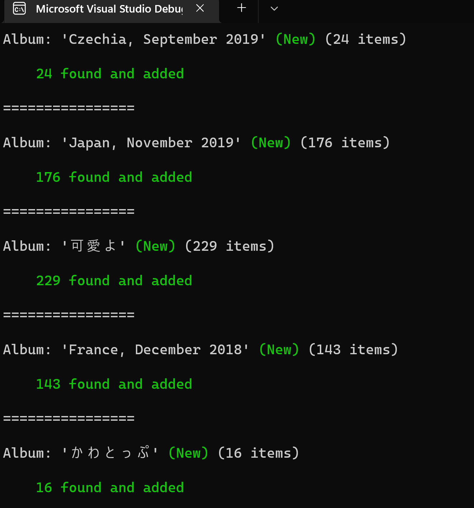

# MicrosoftPhotosSync

Syncs albums from one Microsoft Photos db to another.

The goal is to sync local albums. Note that this is different from backing up to OneDrive, a feature that Photos support.
Backing up to OneDrive works by duplicating these pictures even if they're already stored in OneDrive.

> Use this tool at your own risk. This tool is destructive, so make sure to backup the LocalState folder (mentioned below) before you run this.

## Location

Microsoft Photo's DB is usually located in a LocalState folder at the following path:
%LOCALAPPDATA%\Packages\Microsoft.Windows.Photos_8wekyb3d8bbwe\LocalState

The DB's file name is:
MediaDb.v1.sqlite

## Install

Right now, you can only use this tool by building it yourself.

## Usage

> For this to work, pictures on your new machine should have the exact same path as they did on your old machine.

First, backup your old DB by copying the whole LocalState folder to a safe place.

Put this backup somewhere on your new machine, close Photos, and then using this tool:

```
mps /path/to/backup/MediaDb.v1.sqlite %LOCALAPPDATA%\Packages\Microsoft.Windows.Photos_8wekyb3d8bbwe\LocalState\MediaDb.v1.sqlite --dry
```

The "--dry" option above will make the tool show you what it'll change without doing anything actually destructive. When you're ready to actually change the DB, remove the "--dry" option from the command above.

## Sample run


